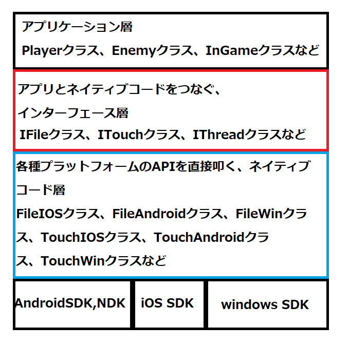

# Chapter-3 柔軟なコードが必要になる実例
&emsp;このチャプターでは、私の経験から柔軟なコードが必要になった実例として、スマートフォンゲームエンジンの開発の話を紹介します。

## 3.1 iOS、Android、WindowsOS対応のスマートフォンゲームエンジン
&emsp;私は、スマートフォンゲームの黎明期にiOS、Android、WindowsOSで動作するスマートフォンゲームエンジンの開発を行ったことがあります。そのゲームエンジンでは、ゲームプログラマがC++でゲームのコードを書けるようにすることを目的としたエンジンでした。</br>
&emsp;当時はちょうどUnityの黎明期で、私もこのエンジンの開発の前にUnityを利用したスマートフォンアプリの開発を行っていました。しかし、著者自身のUnityに対する理解の浅さと、Unityの黎明期ということで、今のように色々な最適化のノウハウもまだまだ足りていなかったという側面もあって、UnityとUnityで使えるC#という言語について、「パフォーマンスが出せない」、「メモリ管理を自由に行えない」といったネガティブな印象を持ってしまいました。そこで、次の開発に向けて、この二つの問題を解決するために、C++でコードを書けるiOS、Android向けのスマートフォンゲームエンジンを開発する流れになったのです。</br>
&emsp;幸いにして、iOSはC++のスーパーセット言語のobjective C++、AndroidはJava言語を利用するのですが、C++でネイティブコードを開発することができるAndroid NDKというものが用意されていたため、また、グラフィックスAPIはともにOpenGLESを採用していたため、C++でゲームを作成することは可能でした。しかし、C++で記述できるとはいえ、iOSはobjective C++、AndroidはJavaという大きな環境の違いがあったため、まったく同じコードで両者で動くゲームを開発できるわけではありませんでした。</br>
&emsp;また、当時のスマートフォン向けのゲーム開発の開発環境は貧弱なものしかなく、まともにスマートフォンゲームのデバッグができるようなものではありませんでした。iOSは幾分ましでしたが、Androidに至ってはC++で書かれたコードをまともにデバッグできるものはありませんでした。そこで、普段はVisualStudioという優秀なIDEを使うことができる、Windows上で開発を行えるようにするという目標も生まれました。</br>
&emsp;このような背景から、iOS、Android、WindowsOSで動作するスマートフォンエンジンの開発がスタートしました。

## 3.2 クリアすべき課題
&emsp;まず、クリアしなくてはいけない課題として、iOS、Android、WindowsOSでゲームアプリ―ケーション層のプログラムを統一できるようにする必要がありました。前節で解説したように、iOSもAndroidもWindowsOSもC++で開発することができます。しかし、すべての処理を同じコードで記述することができるかというと、それは不可能でした。</br>
&emsp;例えば、タッチパネルへのタッチの検出ですが、iOSとAndroidではタッチパネルの操作を取得するためのAPIがそもそも違います。また、WindowsOSに関してはタッチパネルでの操作は想定していないため、マウス操作をタッチパネルの操作に変換する必要がありました。その他にもファイル入出力、スレッド関係の処理、通信などなど、iOS、Android特有のAPIを利用するコードは軒並みNGです。次のコードはファイル入出力処理のiOS、Androidの疑似コードです。</br>
[iOS]</br>
```cpp
// test.csvから1行読み込み
NSString *filePath = @"/Users/test/Desktop/test.csv";
NSString *text = [NSString stringWithContentsOfFile:filePath encoding:NSUTF8StringEncoding error:nil];
```
[Android]</br>
```cpp
char line[256];

FILE* fp = fopen("/sdcard/test.csv","r");
if(fp)
{
    fgets(line,256,fp);
    fclose(fp);
}
```
これらの違いを解決するために、私はiOS、Android、WindowsOSの専用APIを直接叩くネイティブコード層と、ゲーム側のプログラムを記述するアプリケーション層との間に、インターフェースクラス用意することにしました(図3.1)。</br>
**[図3.1]**</br>
</img></br>
&emsp;インターフェース層を用意することで、変化が起きる部分(各種プラットフォームのAPIに依存する部分)を隠ぺい、カプセル化してしまい、交換可能にするという、まさにここまで説明してきたことを実現していたわけです。このエンジンの設計では、この後のチャプターで解説するデザインパターンがいたる箇所で使われています。アプリケーション側はインターフェースクラスを利用して、ゲームをプログラミングすることとなります。背景のプラットフォームに依存する実装は、見事にカプセル化されているため、プラットフォームが切り替わっても、ゲームのコードは大きな変更なしで動作します。

## 3.3【ハンズオン】プラットフォームの変更による実装の切り替えを体験してみよう
&emsp;では、簡単なプログラムで、iOS、Androidのプラットフォームの変更による、タッチ処理の実装の切り替えを体験してみましょう。やっていることは、Chapter2でやったポリモーフィズムを活用しているだけです。では、Sample_03_01/Sample_03_01.slnを立ち上げてください。

### step-1 タッチ状況を取得するためのインターフェースクラスを実装する。
&emsp;まずは、タッチの実装を隠ぺいするためのインターフェースクラスを実装します。ITouch.hを開いて、該当するコメントの箇所に次のプログラムを入力してください。このクラスは図3.1のインターフェース層のクラスになります。</br>
[ITouch.h]
```cpp
// step-1 タッチ状況を取得するためのインターフェースクラスを実装する。
class ITouch
{
public:
	// タッチされた座標を取得。
	// x : x座標
	// y : y座標
	virtual void GetTouchPosition(float& x, float& y) const = 0;
	// 画面がタッチされているか判定。
	// trueが返ってくるとタッチされている。
	virtual bool IsPressTouch() const = 0;
};
```

### step-2 iOS向けのタッチ状況取得クラス宣言を実装。
&emsp;続いて、iOS向けのタッチ取得クラスの宣言を実装します。このクラスは図3.1のネイティブコード層にあたります。直接iOS SDKのAPIを叩くクラスですね。では、TouchIOS.hを開いて、該当するコメントの箇所に次のプログラムを入力してください。</br>
[TouchIOS.h]
```cpp
// step-2 iOS向けのタッチ状況取得クラス宣言を実装。
class TouchIOS : public ITouch
{
public:
	// タッチされた座標を取得。
	// x : x座標
	// y : y座標
	void GetTouchPosition(float& x, float& y) const override;
	// 画面がタッチされているか判定。
	// trueが返ってくるとタッチされている。
	bool IsPressTouch() const override;
};
```

### step-3 iOS向けのタッチ状況取得クラス定義を実装。
&emsp;TouchIOSクラスの宣言が実装出来たので、次はクラス定義を実装します。TouchIOS.cppを開いて該当するコメントの箇所に次のプログラムを入力してください。本来はここで、iOS SDKを利用して、直接APIを叩くコードを実装するのですが、今回は疑似コードなので、コンソール出力でiOS向けのプログラムが呼ばれていることだけ分かるようにしています。</br>
[TouchIOS.cpp]
```cpp
// step-3 iOS向けのタッチ状況取得クラス定義を実装。
void TouchIOS::GetTouchPosition(float& x, float& y) const
{
	std::cout << "iOSのタッチ座標取得処理\n";
	x = 10.0f;
	y = 20.0f;
}
bool TouchIOS::IsPressTouch() const
{
	std::cout << "iOSのタッチ判定処理\n";
	return true;
}
```
### step-4 Android向けのタッチ状況取得クラス宣言を実装。
&emsp;続いて、Android向けです。やることはiOSとほとんど同じです。TouchAndroid.hを開いて、該当するコメントの箇所に次のプログラムを入力してください。</br>
[TouchAndroid.h]
```cpp
// step-4 Android向けのタッチ状況取得クラス宣言を実装。
class TouchAndroid : public ITouch
{
public:
	// タッチされた座標を取得。
	// x : x座標
	// y : y座標
	void GetTouchPosition(float& x, float& y) const override;
	// 画面がタッチされているか判定。
	// trueが返ってくるとタッチされている。
	bool IsPressTouch() const override;
};
```

### step-5 Android向けのタッチ状況取得クラス定義を実装。
&emsp;宣言が実装出来たので、iOS版と同様にクラス定義を実装しましょう。TouchAndroid.cppを開いて、次のプログラムを入力してください。こちらもiOS版と同様に疑似コードとなっています。</br>
[TouchAndroid.cpp]
```cpp
// step-5 Android向けのタッチ状況取得クラス定義を実装。
void TouchAndroid::GetTouchPosition(float& x, float& y) const 
{
	std::cout << "Androidのタッチ座標取得処理\n";
	x = 10.0f;
	y = 20.0f;
}

bool TouchAndroid::IsPressTouch() const
{
	std::cout << "Androidのタッチ判定処理\n";
	return true;
}
```

### step-6 選ばれたプラットフォームに応じて、タッチ入力処理のインスタンスを作成する。
&emsp;続いて、タッチ処理のインスタンス作成です。この処理は図3.1のアプリケーション層のプログラムになります。main.cppを開いて、次のプログラムを入力してください。</br>
[main.cpp]
```cpp
// step-6 選ばれたプラットフォームに応じて、タッチ入力処理のインスタンスを作成する。
ITouch* touch = nullptr;
switch (platform) {
case '0':
    touch = new TouchIOS;
    break;
case '1':
    touch = new TouchAndroid;
    break;
}
```
&emsp;選ばれたプラットフォームに応じて、TouchIOS、TouchAndroidのインスタンスを作成して、そのインスタンスのアドレスをITouchのポインタ変数に記憶しています。以降、アプリケーション層では、touch変数を介して、各種実装クラスのプログラムを呼び出すことができます。

### step-7 タッチ入力の各種処理を呼び出す。
&emsp;これで最後です。インタフェースを介して、各種プラットフォームに依存するプログラムを呼び出すコードを記述しましょう。該当するコメントの箇所に次のプログラムを入力してください。</br>
[main.cpp]
```cpp
// step-7 タッチ入力の各種処理を呼び出す。
if (touch->IsPressTouch()) {
    // タッチされていたら座標を取得する。
    float x, y;
    touch->GetTouchPosition(x, y);
}
```
&emsp;入力出来たら、実行してみてください。これで選ばれたプラットフォームによって、タッチ入力処理の実装を切り替えることが可能なプログラムが実装出来ました。ちなみにこの設計はStrategyパターンと呼ばれるデザインパターンで設計されており、このパターンが最も基本となるデザインパターンであると私は考えています。