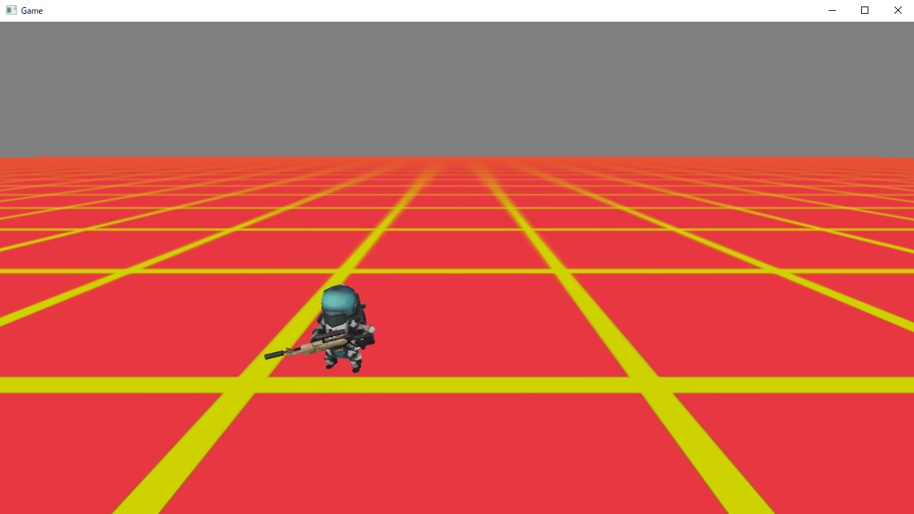

# Chapter-1 Commandパターン

## 1.1 Commandパターンとは？
&emsp;Commandパターンとは、オブジェクトに対する命令を流動的要素ととらえて、変更可能にするパターンです。例えば、対戦格闘ゲームであれば、Xボタンを押したら「弱攻撃」、Yボタンを押したら「強攻撃」、Bボタンを押したら「ガード」、Aボタンを押したら「ジャンプ」するなどです。これらの弱攻撃、強攻撃などが命令です。プログラムでは、典型的なプログラムでは次のように書くことでしょう。</br>

```cpp

void Character::Update()
{
  if( g_pad[0]->IsTrigger(enButtonA)){
    // ジャンプ。
    Jump();
  }
  if( g_pad[0]->IsPress(enButtonB)){
    // ガード。
    Guard();
  }
  if( g_pad[0]->IsTirgger(enButtonX)){
    // 強攻撃
    StrongAttack();
  }
  if( g_pad[0]->IsTrigger(enButtonY)){
    // 弱攻撃
    LightAttack();
  }
}
```
&emsp;このコードはキャラクターのアクションと命令が強く結合しています。Commandパターンを使うと、これを分離することができます。まだ、分離できると何ができるの？となりますよね。先に結論を言いますと、Commandパターンを利用することで、例えば対戦格闘ゲームなどでは、キャラクターのアクションのプログラムを人間が操作する場合と、AIが操作する場合とで共通化することができます。
## 1.2 なぜオブジェクト指向で作るのか？
&emsp;オブジェクト指向について見ていく前に、なぜオブジェクト指向で作るのか？についてみていこうと思います。結論から言うと、オブジェクト指向でプログラミングをした方が、ある程度大きなソフトウェアであれば、開発をするのが楽になるからです。私はオブジェクト指向プログラミングを行った際に、大きなソフトウェアの開発効率が上がる理由として、次の３点があると考えています。

1. 可読性の向上
2. 保守性の向上
3. 再利用性の向上

### 1.2.1 可読性の向上
&emsp;可読性とはプログラムの読みやすさです。適切なオブジェクト指向設計を行うと、小さな意味のある単位、でソースファイルは分割されていきます。例えば、Player.cpp、Enemy.cpp、Boss.cpp、PlayerAnimation.cppなどです。すると、どのソースファイルに目的のプログラムが書かれているのかを見つけ出すことが容易になります。先ほどの例で行けば、プレイヤーに関する処理はPlayer.cpp、敵キャラクターに関する処理はEnemy.cpp、プレイヤーのアニメーションに関する処理はPlayerAnimation.cppのように。また、この本の本題である、デザインパターンを使うことで、凝集度が高く、結合度が低いプログラムを設計することが可能になります。凝集度が高く、結合度が低いということがどういうことかというと、簡潔に説明すると「あるモジュールの処理に、そのモジュールに関係が薄いプログラムが少ないということです。」ここで言っているモジュールはクラスに置き換えて読んでもらって構いません。例えば、敵キャラクターのソースファイルのEnemy.cppが、凝集度が高く、結合度が低い実装になっていると、Enemy.cppには、敵キャラクターの処理に関係がないプレイヤーのプログラムだとか、ギミックのプログラムなどがあまり出てこない、ということです。です　　ので、敵キャラクターのソースファイルを読んでいるプログラマは、目的の処理のみに集中してコードを読むことができるようになります。

### 1.2.2 保守性の向上
&emsp;保守性とは、プログラムのメンテナス、変更のしやすさを指しています。保守性は先ほどの可読性と通じる部分もあります。プログラムを意味のある単位で分割ができていると、メンテナンス、変更をする際に、目的となるソースファイルをすぐに見つけることができます。また、保守性はクラスのカプセル化を行うことで、高めることもできます。しばしば、オブジェクト指向設計の入門書にはカプセル化とは、クラスのデータメンバを隠ぺいするものである、というように説明されていますが、カプセル化とは、ありとあらゆるものを隠ぺいすることを指します。例えばそれが、データメンバであったり、実装の詳細であったり、インターフェースであったり。カプセル化を行うことで、ありとあらゆるものの詳細を隠ぺいすることができるようになるため、その詳細をこっそりと変更することが容易になります。隠ぺいしているものを変更するだけなので、変更したことをその他大勢のプログラムに教える必要がなくなるのです。これについてはデザインパターンを見ていく際に、もっと詳細に説明します。

### 1.2.3 再利用性の向上
&emsp;オブジェクト指向言語で言われる再利用とは実装の再利用と、設計の再利用の二つを指します。実装の再利用は、既存のプログラムを再利用するというものです。例えば、本書に付属しているMiniEngineなどのクラスは、学生が作成する多くのゲームで利用されることを想定しているため、再利用性の高いプログラムとなっています。実装の再利用は、移譲と継承の二つの選択肢があります。これについては、後ほど詳細に解説しますが、多くの場合で、実装の再利用を行いたい場合は、継承より移譲を選択したほうが良い設計となります。実装の継承はクラスの爆発など多くの問題をはらんでいます。設計の再利用は、本書のテーマであるデザインパターンと強く関連している内容となります。

## 1.3	オブジェクト指向とは
&emsp;さて、オブジェクト指向とはいったいどのようなものなのでしょうか。私が初めてC++を学んだ時に、「オブジェクト指向とは、現実世界のモノに着目してプログラミングをすることである」と学びました。現実世界のモノがクラス、そのモノを操作するための命令がメンバ関数になるといった感じです。例えば、レースゲームを作っている際に、車のプログラミングをするのであれば、Carクラスを作成します。また、車を操作するための「ブレーキをかける」、「アクセルを踏む」といった操作をメンバ関数として用意します。これをプログラミングすると、次のようなコードになります。

```cpp
// 車クラス
class Car{
public:
  // ブレーキをかける。
  void Brake();
  // アクセルを踏み込む。
  void Accele();
  // 走らせる。
  void Run();
}
```

&emsp;このCarクラスは次のコードのように、インスタンスを作成して利用されると思います。

```cpp
Car c;
if( g_pad[0].IsPress( enButtonA ) ){
  // ゲームコントローラーのAボタンが押されているのでアクセルをかける。
  c.Accele();
}
if( g_pad[0].IsPress(enButtonB)){
  // ゲームコントローラーのBボタンが押されているのでブレーキをかける。
  c.Break();
}
// 車を走らせる
c.Run();
```

&emsp;現実世界のモノをクラスにして、そのモノに対する操作をメンバ関数にするというのは、理解しやすい話なので、入門書などによく書かれているのだと思われます。しかし、私はこの話を聞いたときに、クラスをゲームのプログラムで、作ることはほとんどないのではないか？と考えてしまいました。私はこの話を聞いたときに、プログラミング学び初めて１年ほどで、ちょうどC言語を利用して、小さな2Dゲームを作っていたころだったと思います。そのゲームは、プレイヤーキャラクターが出てきて、マップを徘徊している５体の敵キャラクターをすべて倒したらゲームクリアといったゲームでした。このゲームはC言語で作っていたのですが、C++を利用して作ったらどうなるか？と考えたのです。そうすると、せいぜい３つ程度のクラスしか思いつきませんでした。それは、プレイヤークラス、エネミークラス、背景クラスです。ひょっとすると当時は背景クラスは思いついていなかったかもしれません。この時私は、「これは私が作った小さなゲームだからそうなのかもしれない」と思い、市販のゲームでもいくつのクラスが作れるのか考えてみました。それでも結果に大きな違いはなく、せいぜい、10個程度のクラスしか思いつきませんでした。</br>
&emsp;さて、なぜ、私はこんなことになってしまったのか？それは「オブジェクト指向とは、現実世界のモノに着目してプログラミングをすることである」という説明のせいです。この説明は、オブジェクト指向に対する、大変狭いものの見方です。これは正確には「オブジェクト指向プログラミングでは、現実世界のモノをプログラミングすることもできる」だったのです。現実世界のモノをプログラミングするというのは、あくまでオブジェクト指向プログラミングの一部であり、イコールではなかったわけです。では、オブジェクト指向の正しい定義は何なのでしょうか。オブジェクト指向プログラミングとは、ソフトウェアを作るうえで実装する必要のある、概念、機能を実装するための、振る舞いとデータを一つにまとめてプログラミングをしていくことです。現実世界のモノに着目するわけではないのです。ソフトウェアを作る際に解決する必要のある問題領域、概念、機能に着目して、プログラミングを行うのです。</br>
&emsp;では、例えば、先ほどの私が作ったゲームを例に、現実世界のモノに着目するのではなく、ゲームを作るために、解決する必要のある問題猟奇、概念、機能に着目して考えてみましょう。そのゲームには、敵キャラクターがいたので、敵のプログラムを実装する必要があります。ですので、Enemyクラスなどを実装するのは容易に想像できます。さて、この敵キャラクターを実装するためには、どのような機能を実装する必要があるのでしょうか。この敵キャラクターはプレイヤーキャラクターを発見していないときは、マップをランダムに徘徊していました。これも解決する必要がある問題領域です。このゲームでは、敵キャラクターはマップをランダムに徘徊できるようにする必要があったのです。そこで、EnemyMoveRandomというクラスを作ることが考えられます。他にはどうでしょうか。おそらく敵キャラクターの絵を画面に表示する機能も必要だったはずです。そこで、EnemyRendererというクラスを作ることも考えられます。敵キャラクターをアニメーションさせる必要もあったかもしれません。そうすると、EnemyAnimatorというクラスが必要になるかもしれません。ここまでに上げてきた、EnemyMoveRandom、EnemyRenderer、EnemyAnimatorは「現実世界のモノに着目してプログラミングする」という考え方に縛られていると生まれてこないクラスです。これらのクラスは、オブジェクト指向とは「オブジェクト指向とは、実装する必要のある、概念、機能をオブジェクトととらえてプログラミングすることである」と大きくとらえることで、生み出すことができるクラスです。

## 1.3 コンポーネント指向とオブジェクト指向
&emsp;オブジェクト指向ほど聞きなじみがないかもしれませんが、コンポーネント指向という考え方があります。コンポーネント指向はソフトウエアを機能ごとに部品として分割し、必要に応じて組み合わせて使うという考え方です。この考え方で設計されているゲームエンジンがUnityです。Unityでは、敵キャラクターを実装したいときに、GameObjectというオブジェクトに、絵を描画するためのMeshRendererコンポーネント、アニメーションを再生するためのAnimatorコンポーネント、GameObjectをランダムに動かすためのRandomMoveコンポーネントなど複数のコンポーネントを組み合わせて、実装していきます。</br>
&emsp;さて、ここで1.2節のEnemyクラスの実装の話を思い出してみてください。同じようなことを言っていることに気づいてもらえたでしょうか？1.2節でも敵キャラクターを実装するために、ランダム移動するEnemyMoveRandomクラスを作るだとか、絵を表示するためにEnemyRendererクラスを作るという話をしたと思います。実はコンポーネント指向と優れたオブジェクト指向が目指している方向はイコールなのです。また、コンポーネント指向は、その部品を容易に変更可能とします。例えば、ランダム移動ではなく、決められた経路上を移動する敵キャラクターを作りたい場合は、RandomMoveコンポーネントの代わりにPathMoveコンポーネントを使えばよいのです。多くのデザインパターン、特にGofが提唱した23個のデザインパターンの多くは、まさにソフトウェアを作る際に、部品を容易に交換可能にすることを目的としたものとなります。例えば、先ほどのUnityのGameObjectとComponentの関係などは、まさにGoFが提唱したBridgeパターンの亜種だと言えます。

## 1.4 責任の移譲
&emsp;さて、1.3節で優れたオブジェクト指向とはコンポーネント指向であると説明しました。つまり、優れたオブジェクト指向とは、何かの処理を実現したい場合に、部品を組み合わせて実装していくということになります。では、この観点から考えていくと、何かの処理を実装するときには、どのような部品、機能が必要だろうか？と洗い出す必要があります。これを洗い出すためにはまず、そのクラスがもっている責任について考えてみるのはよいアプローチです。責任について考えるというのは、そのクラスは要求を実現するために、何をする必要があるのか？ということについて考えていくということです。</br>
&emsp;では、先ほどのマップをランダムに移動するEnemyクラスの実装にについて考えてみましょう。このEnemyクラスを実装するためには、1.2節で考えたように、マップ上をランダムに移動できる責任、絵を正しく画面に表示する責任、アニメーションを正しく再生する責任などがあります。Enemyクラスがクラス分割できていない状態は、これらの処理がすべてEnemyクラスに記述されていることになります。この時、Enemyクラスは大きな責任を背負っていることとなります。このような、大きすぎる責任を背負っているクラスのことを、まるで神のようなクラスだと揶揄して、GODクラスなどと呼びます。</br>
&emsp;現実世界でも同じですが、大きな責任を背負っているものは、その責任の重さで押しつぶされてしまうものです。プログラミングを行うのは人間ですので、この原則はそのままプログラミングにも当てはまります。大きすぎる責任を追っているクラスは、往々にして、クラスの実装の行数が多くなります。そのようなクラスの処理を変更する場合、たとえ小さな変更であっても、多くの処理に影響を与えます。また、その変更の影響範囲を把握するのも困難です。</br>
&emsp;例えば、敵キャラクターの描画処理に関するプログラムを変更した場合にも、その変更による影響範囲を確認するために、キャラクターの描画処理がどこに書かれているのかを把握する必要があります。また、キャラクターの描画処理というのは、アニメーションのプログラムと関連があるかもしれません。そうなると、アニメーションのプログラムが記述されている箇所も把握する必要が出てきます。もし、これが適切にクラス分割されていて、EnemyRendererクラスやEnemyAnimatorクラスなどがあれば、話は簡単です。描画処理はEnemyRendererクラスに記述されているはずですし、アニメーションを制御する処理はEnemyAnimatorクラスに記述されているからです。</br>
&emsp;このように、大きなクラスから、別のクラスに責任を譲り渡すことを移譲といいます。今回のケースで言えば移譲とは単に、Enemyクラスの中で記述されていた描画処理をEnemyRendererクラスに、アニメーション制御に関する処理をEnemyAnimatorクラスに移動させるといったものです。そして、Enemyクラスはこれらのクラスのインスタンスをメンバ変数に持ち、あとの処理はよろしく！というように、それらのクラスに責任をなすりつけるのです。これが責任の移譲です。

## 1.5 【ハンズオン】Enemyクラスから移動処理を委譲してみよう。
&emsp;さて、このハンズオンでは、Enemyクラスに実装されている、エネミーの移動処理を、別のクラスに委譲するハンズオンを行っていきます。ですので、ハンズオンを行う前に、もともとのEnemyクラスの実装を確認しておきましょう。Sample_01_01/Sample_01_01_Before.slnを立ち上げてください。立ち上がったらF5を押して、プログラムを実行してみてください。すると図1.1のようなゲームが実行されます。</br>
**[図1.1]**</br>
</img></br>

### point-1 移動処理に関するメンバ変数。
&emsp;では、今回ポイントとなるプログラムを確認してみましょう。Enemy.before.hを開いてください。リスト1.1のプログラムは移動処理に関するメンバ変数です。</br>
[リスト1.1 Enemy.before.h]
```cpp
// point-1 移動処理に関するメンバ変数
Vector3 m_moveSpeed;	// 移動速度。
int m_moveTimer = 0;	// 移動タイマー。
// point-1 ここまで
```
移動速度と移動に関係するタイマーがEnemyクラスのメンバ変数として保持されています。この二つのメンバ変数はこの後のハンズオンで、新しく追加されるEnemyRandomMoveクラスに移動します。

### point-2 ランダム移動に関する処理。
&emsp;続いて、ランダム移動に関する処理の実装を見ていきましょう。この処理もEnemyクラスに記述されています。Enemy.before.cppを開いてください。リスト1.2のプログラムが120フレームごとにランダムに移動速度を決定して、その移動速度をエネミーの座標に足し算して、エネミーを動かしているプログラムです。</br>
[リスト1.2 Enemy.before.cpp]
```cpp
// point-2 ランダム移動に関する処理
// ランダムに移動速度を決定。
if (m_moveTimer % 120 == 0) {
  // 120フレームで移動方向を変更する。
  std::random_device rd;
  m_moveSpeed.x = (rd() % 100) / 100.0f;
  m_moveSpeed.x -= 0.5f;
  m_moveSpeed.z = (rd() % 100) / 100.0f;
  m_moveSpeed.z -= 0.5f;
  // 正規化する。
  m_moveSpeed.Normalize();
  // 移動速度は0.3。
  m_moveSpeed *= 0.3f;
}
// 移動タイマーをインクリメント
m_moveTimer++;
// 移動速度を座標に加算。
m_position += m_moveSpeed;
// point-2 ここまで
```
&emsp;プログラム自体はたいしたプログラムではないので、特別な解説は入れません。重要なのは、今見ていったEnemyクラスの処理を、新たに追加するEnemyRandomMoveクラスに移行して責任を委譲するということです。

### step-1 敵キャラクターのランダム移動クラスの宣言を実装する。
&emsp;では、エネミーの移動処理の責任を委譲していくハンズオンを実施しましょう。Sample_01_01/Sample_01_01.slnを開いてください。まずは、ランダム移動クラスの宣言を実装します。EnemyRandomMove.hを開いてリスト1.3のプログラムを該当するコメントの箇所に入力してください。</br>
[リスト1.3 EnemyRandomMove.h]
```cpp
// step-1 敵キャラクターのランダム移動クラスの宣言を実装する。
class EnemyRandomMove {
public:
	// 移動処理を実行する関数。
	// 引数に移動させる座標の参照を受け取る。
	void Execute(Vector3& pos);
private:
	Vector3 m_moveSpeed;	// 【注目】移動速度。
	int m_moveTimer = 0;	// 【注目】移動タイマー。
};
```
&emsp;EnemyRandomMoveのメンバ変数に注目してください。元々のEnemyクラスに定義されていたものと同じ変数が用意されています。

### step-2 敵キャラクターのランダム移動クラスの定義を実装する。
&emsp;続いて、実際にEnemyを移動させる処理を実装していきます。EnemyRandomMove.cppを開いて。リスト1.4のプログラムを入力してください。</br>
[リスト1.4 EnemyRandomMove.cpp]
```cpp
// step-2 敵キャラクターのランダム移動クラスの定義を実装する。
void EnemyRandomMove::Execute(Vector3& pos)
{
    // ランダムに移動速度を決定。
	if (m_moveTimer % 120 == 0) {
		// 120フレームで移動方向を変更する。
		std::random_device rd;
		m_moveSpeed.x = (rd() % 100) / 100.0f;
		m_moveSpeed.x -= 0.5f;
		m_moveSpeed.z = (rd() % 100) / 100.0f;
		m_moveSpeed.z -= 0.5f;
		// 正規化する。
		m_moveSpeed.Normalize();
		// 移動速度は0.3。
		m_moveSpeed *= 0.3f;
	}
	// 移動タイマーをインクリメント
	m_moveTimer++;
	// 移動速度を座標に加算。
	pos += m_moveSpeed;
}
```
&emsp;見てもらえば分かるように、この処理も元々のEnemyクラスに実装されていたものとほとんど同じです。このExecute関数の引数に移動させるエネミーの座標の参照を渡すことで、移動させる処理を実現しています。

### step-3 ランダム移動処理のインスタンスをEnemyクラスのメンバ変数に追加。
&emsp;続いて、ランダム移動処理のインスタンスをEnemyクラスのメンバ変数として追加します。Enemy.hを開いて、リスト1.5のプログラムを入力してください。</br>
[リスト1.5 Enemy.cpp]
```cpp
// step-3 ランダム移動処理のインスタンスをEnemyクラスのメンバ変数に追加。
EnemyRandomMove m_randomMove; // ランダム移動処理。
```
Enemyクラスのメンバ変数から、元々のEnemyクラスに存在していた、移動速度を表すm_moveSpeedと移動タイマーのm_moveTimerがなくなっている点にも注目してください。これらの変数は、EnemyRandomMoveクラスに移動したので、Enemyクラスからはなくなっています。

### step-4 ランダム移動処理のインスタンスをEnemyクラスのメンバ変数に追加。
&emsp;では、これで最後です。エネミーを移動させる処理の実行をEnemyRandomMoveクラスに委譲しましょう。Enemy.cppにリスト1.6のプログラムを入力してください。</br>
[リスト1.6 Enemy.cpp]
```cpp
// step-4 移動処理をEnemyRandomMoveに委譲する。
m_randomMove.Execute(m_position);
```
&emsp;入力出来たら実行してみてください。Sample_01_01_Before.slnを実行したときと同じように、エネミーが移動してたら完成です。</br>
&emsp;さて、いかがでしょうか。委譲といっても何も難しいことはありません。なんだ、こんな簡単なことを何を偉そうに語っているんだと思われた方もいるかもしれません。しかし、このなんてことのない、簡単な考え方が、非常に重要なことなのです。今回実装したプログラムが、なんてことない普通のプログラムに感じた方はその感覚を持ったまま次に進んでいってください。

## 1.5 仕様変更と追加
&emsp;ゲームだけではなく、ソフトウェアの開発において、仕様の変更と追加というものは必ず発生します。ゲームの開発というのは、答えのないものを作り上げていくものであるため、作ってみて面白くなかったから仕様を変更したい、もっと面白くするために、仕様を追加したいという欲求が確実に生まれます。また、一昔前であれば、ゲームは発売日にリリースされれば、そこで終わりというビジネスモデルでしたが、近年はアップデートなどでドンドン仕様を追加、変更してサービスが継続するというビジネスモデルになってきています。そのため、ゲーム開発は仕様変更、追加はあって当たり前の世界になっています。しかし、ある程度の規模のゲーム開発の経験がある方であれば、仕様変更や仕様追加によるソースコードの変更によって、予期せぬバグを生み出した、という経験があると思います。多くのバグはソースコードの変更によって生み出されています。不具合を生まない一番の方法はプログラムを書かないことです。これは重要です。不具合を生まない一番の方法はプログラムを書く量を減らすことです。GoFが提唱した多くのデザインパターンは、これが大きなテーマとなっており、多くのパターンが何かの機能を追加、変更する際に、その機能に関係しない、その他のプログラムへの影響を減らすための設計を与えてくれます。この設計を行うために重要になってくる要素がカプセル化です。カプセル化とはありとあらゆるものの隠ぺいでしたね。あるモジュールの詳細をカプセル化によって隠ぺいすることによって、変更による外部への影響を最小限にする。これがカプセル化の意義です。入門書などでは、カプセル化とはデータの隠ぺいであると説明されるがそれは正しい説明ではないと言いました。データの隠ぺいはあくまでカプセル化の一部です。しかし、カプセル化の中でもっとも理解しやすいものであることも間違いないので、データを隠ぺいすることでなぜ修正に強くなるのか？、具体例を上げて見ていきましょう。リスト1.7のプログラムは、キャラクターデータを表しているクラスです。このクラスには、キャラクターの所持金を表すメンバ変数が存在していますが、アクセス指定子がpublicとなっており、データが隠ぺいされていません。</br>
[リスト1.7]
```cpp
class CharacterData{
public:
    int m_money;  // 所持金
    　・
    　・
    　・
};
```
&emsp;このゲームでは、モンスターを倒すことや、お店でのアイテムをの売ることでお金を得ることができます。そのため、プログラム中のいたる箇所でリスト1.8のような所持金の値を操作するプログラムが書かれていました。</br>
[リスト1.8] 
```cpp
void SellItem(Character& charaData)
{
    ・
    ・
    ・
  // アイテム売買で使用したお金を足し算。
  charaData.m_money += useMoney;
  if( charaData.m_money > 9999){
    charaData.m_money = 9999;
  }
    ・
    ・
    ・
}

void GetMoney(Character& charaData)
{
    ・
    ・
    ・
  // アイテム売買で使用したお金を足し算。
  charaData.m_money += useMoney;
  if( charaData.m_money > 9999){
    charaData.m_money = 9999;
  }
    ・
    ・
    ・
}
```
&emsp;元々このゲームでは所持金の上限を9999としていたのですが、ある日、所持金の上限を一桁増やした99999に変更する必要が生まれました。そのため、担当のプログラマはリaaaaスト1.9のような変更を加えました。</br>
```cpp
[リスト1.9]
void SellItem(Character& charaData)
{
    ・
    ・
    ・
  // アイテム売買で使用したお金を足し算。
  charaData.m_money += addMoney;
  if( charaData.m_money > 99999){ // 変更
    charaData.m_money = 99999;　  // 変更
  }
    ・
    ・
    ・
}

void GetMoney(Character& charaData)
{
    ・
    ・
    ・
  // アイテム売買で使用したお金を足し算。
  charaData.m_money += addMoney;
  if( charaData.m_money > 99999){ // 変更
    charaData.m_money = 99999;    // 変更
  }
    ・
    ・
    ・
}
```
&emsp;このように４か所の修正が必要となりました。「いやいや、所持金の最大値を定数にして、マジックナンバーをなくせばいいだけじゃないか」という声が聞こえてきそうですが、ここで言いたいことは、m_moneyがpublicメンバとなっているため、外部のどこからでもアクセスできてしまいます。ということは、仕様変更が発生した場合は、m_moneyにアクセスしているすべての外部のコードをチェックして、あますことなく修正する必要があるということです。もし、一か所でも修正忘れの箇所があると、ソースの変更による不具合を生み出してしまうこととなります。もし、リスト1.10のように、m_moneyのアクセス指定子がprivateになっていて、m_moneyを外部から操作できるのが、publicメンバ関数がのみになっている場合、このような仕様変更の対応は非常に容易です。</br>
[リスト1.10]
```cpp
class CharacterData{
private:
    int m_money;  // 所持金
    　・
    　・
    　・
public:
  // お金を加算
  void AddMoney( int addMoney)
  {
    m_money += addMoney;
    if( m_money > 99999){
      m_money = 99999;
    }
  }
};
```
&emsp;このm_moneyが隠ぺいされたCharacterDataクラスを利用すると、お金を加算する外部のコードはリスト1.11のようにCharacterData::AddMoney()関数を利用することになります。こうすることで、今後使用できるお金の上限に関する仕様変更が生まれたとしても、AddMoney関数の中身だけを修正すればよく、それを利用する外部のコードは一切変更する必要がないのです。</br>
[リスト1.11]
```cpp
void SellItem(Character& charaData)
{
    ・
    ・
    ・
  // アイテム売買で使用したお金を足し算。
  charaData.AddMoney( addMoney );
    ・
    ・
    ・
}

void GetMoney(Character& charaData)
{
    ・
    ・
    ・
  // アイテム売買で使用したお金を足し算。
  charaData.AddMoney( addMoney );
    ・
    ・
    ・
}
```
&emsp;今回はカプセル化のデータの隠ぺいという部分だけに注目して解説をしましたが、GoFのデザインパターンの大きなテーマである、実装のカプセル化も同じように、変更に強い設計を与えてくれます。一昔前ならいざ知らず、現在のゲーム開発では長期的なアップデートが予定されているものが多くなっています。変更に強いソフトウェアを設計するためにも、デザインパターンは知っておくことは重要です。

## 1.6 凝集度と結合度
&emsp;そのソフトウェアが変更しやすい設計なのかどうかを図る尺度として、凝集度と結合度というものがあります。凝集度と結合度には相関関係があり、一般的に凝集度が高くなると、結合度は低くなっていきます。逆に凝集度が低くなると、結合度は高くなっていきます。良いソフトウェアを設計するための指針として、高い凝集度と、低い結合度を意識するのは良い習慣です。</br>
&emsp;凝集度とは関連性の強い処理が、どれだけクラス内や同じ名前空間内などに分散せずに集まっているかを表す尺度です。凝集度が高いということは、関連するプログラムが、同じクラス、もしくは名前空間内などに集まっているということです。一般的に凝集度が高いほど良い設計であると言えます。例えば、エネミーのプログラムをまとめるための名前空間のnsEnemyを用意したとします。その場合、エネミーに関するプログラムが名前空間のnsEnemyに集まっている場合、そのプログラムは凝集度が高い設計だといえます。逆にプレイヤーのプログラムをまとめるための、名前空間nsPlayerの中にもエネミーに関するプログラムが含まれている場合、凝集度は低くなります。一般的に凝集度は高く、閉じた設計になっているほど変更に強い設計であると言えます。</br>
&emsp;続いて、結合度です。結合度はクラス間の結びつき具合を示すものです。一般に結合度は低いほど良い設計であると言えます。例えば、クラスAとクラスBの結合度が低いということは、この二つのクラスの関連性が低いということになります。そのため、結合度が低ければ、クラスAの処理を変更した際に、クラスBの処理に影響を与える可能性が低くなります。例えば、先ほどの1.5のハンズオンで実装したEnemyクラスとEnemyRandomMoveクラスは関連しあっているので、結合しています。では、その結合度は高いのでしょうか？低いのでしょうか？実は結合度にはそれを図る尺度があります。表1.1を見てください。</br>
**表1.1**</br>
| 種類 | 説明 |
| ---- | ---- |
| メッセージ結合 |（引数のない）関数の呼び出し。メッセージパッシング |
| データ結合 |モジュールを介してデータを共有する場合、例えば、関数への引数。|
| スタンプ結合 |複数のモジュールで複合データ構造を共有し、その一部のみを使用する。例えば、関数への引数に構造体を使用する場合。|
| 制御結合 |あるモジュールに何をすべきかについての情報（例えば、処理を制御するためのフラグ）を渡すことで、別の処理の流れを制御する。|
| 外部結合 |二つのモジュールは、外部から供給されたデータ·フォーマット、通信プロトコル、またはデバイスインターフェイスを共有している場合に起こる。これは基本的に外部ツールやデバイスへの通信に関連している。|
| 共通結合 |グローバル結合とも呼ばれる。二つのモジュールが同じグローバルデータを共有する。例えば、グローバル変数。共通リソースを変更すると、それを使用したすべてのモジュールを変更することとなる。|
| 内容結合 |あるモジュールが別のモジュールの内部動作によって変化したり依存したりする(例えば別のモジュールの内部データを直接参照する)。|

>https://ja.wikipedia.org/wiki/%E7%B5%90%E5%90%88%E5%BA%A6

&emsp;この表のモジュールというのは、まとまった機能の塊のことを指しており、クラスや関数を指しています。結合度は上から下に向かっていくほど高くなっています。つまり、表1.1の場合、メッセージ結合が最も結合度が低く、内部結合が最も結合度が高くなっています。1.5のハンズオンのEnemyクラスとEnemyRandomMoveクラスの結合度はデータ結合です。ですので、この二つのクラスの結合度は比較的低くなっています。では、各種結合について詳しく見ていきましょう。

### 1.6.1 メッセージ結合
&emsp;この結合は二つのモジュール間で、引数のない関数呼び出ししかしていない結合です。リスト1.12のプログラムを見てください。これがメッセージ結合です。</br>
[リスト1.12]
```cpp
void Enemy::Init()
{
  // 移動処理の初期化関数を呼び出す。
  m_enemyMove.Init();
}
```

### 1.6.2 データ結合
&emsp;続いて、データ結合です。これはメッセージ結合よりも少し結合度が上がります。この結合は二つのモジュール間で、データを共有します。リスト1.13のプログラムを見てください。コードを読んでみると、エネミーの移動処理にエネミーの内部データメンバである、座標データを渡していることがわかります。内部データを他のモジュールに渡しているので、メッセージ結合よりも結合度が上がっているのが直感的にも分かるかと思います。</br>
[リスト1.13]
```cpp
void Enemy::Update()
{
  // m_positionはEnemyクラスのメンバ変数。
  // エネミーの座標を引数に渡して、移動処理を実行する
  m_enemyMove.Execute( m_position );
}
```
### 1.6.3 スタンプ結合
&emsp;スタンプ結合は、複数のモジュール間で複合データ構造を共有し、その一部のみを使用する結合です。これは、関数の引数に構造体を渡すような場合の話なのですが、呼び出された関数の中で、その構造体のデータの一部のみしか使わないような結合です。リスト1.14を見てください。</br>
[リスト1.14]
```cpp
// エネミーのデータをまとめた構造体。
struct EnemyData{
  int hp;   // 体力
  int mp;   // マジックパワー
  int atk;  // 攻撃力
  int def;  // 守備力
};

void Enemy::Update()
{
  // m_enemyDataはEnemyData型のメンバ変数。
  // エネミーの攻撃処理に、m_enemyDataを丸ごと渡す。
  m_enemyAttack.Execute( m_enemyData );
}

        ・
　      ・
　      ・
// エネミーの攻撃処理
void EnemyAttack::Execute( EnemyData& enemyData )
{
        ・
        ・
        ・
  // プレイヤーにダメージを与える処理を実行しているが、
  // この関数の中では、enemyData.atkしか参照していない。
  m_player->ApplyDamage(enemyData.atk);
  　    ・
  　    ・
  　    ・
}
```
&emsp;スタンプ結合は不要なデータまでモジュール間で共有しており、こちらもデータ結合と比べると結合度が上がっていることが分かりやすいかと思います。この結合では、構造体の構造に変化があると、EnemyAttackクラスを修正する必要が生まれる可能性があります。例えば、EnemyData構造体からatkメンバがなくなるなどです。対処方法としては、EnemyAttack::Execute()関数は攻撃力のパラメータを受け取ればいいだけなので、リスト1.15のように実装を変更して、より結合度の低いデータ結合にすることが考えられます。</br>
[リスト1.15]
```cpp
void Enemy::Update()
{
  // エネミーの攻撃処理に、m_enemyDataを丸ごと渡すのではなく、
  // m_enemyData.atkを渡す。
  m_enemyAttack.Execute( m_enemyData.atk );
}
        ・
        ・
        ・
// エネミーの攻撃処理
void EnemyAttack::Execute( int atk )
{
        ・
        ・
        ・
  m_player->ApplyDamage(atk);
  　    ・
  　    ・
  　    ・
}
```
### 1.6.4 制御結合
&emsp;続いて制御結合です。この結合は他のモジュールの処理に影響を与える結合です。例えば、あるクラスの関数の引数に、その関数の動作を制御するフラグを渡すような場合です。これまでの結合と違い、内部の処理の流れに影響を与える結合となっています。リスト1.16が制御結合の例です。</br>
[リスト1.16]
```cpp
void Enemy::Update()
{
        ・
        ・
        ・
  // 実行する移動の種類を引数で渡す。
  m_enemyMove.Execute( 0 );
        ・
        ・
        ・
}
        ・
        ・
        ・
void EnemyMove::Execute( int moveType )
{
  switch(moveType){
  case 0:
    // ランダム移動
      ・
      ・
      ・
    break;
  case 1:
    // パス移動
      ・
      ・
      ・
    break;
  }
}
```

### 1.6.5 外部結合
&emsp;この結合は、外部で作られたデータに依存する結合です。本書が提供しているMiniEngineには3Dモデルのモデルフォーマットとして、著者オリジナルのtkmというデータフォーマットがあります。本書のエンジンのModelクラス、MeshPartsクラス、Materialクラスなどは、このtkmファイルのフォーマットに依存するコードがあります。このファイルフォーマットは、本書のエンジンだけではなく、当然ですが、3dsMaxからtkmファイルを出力するための、スクリプトやプラグインにも依存するコードがあります。これらのモジュールは外部結合となっており、tkmファイルのファイルフォーマットに変更があると、すべてのモジュールで修正が発生する可能性があります。</br>
&emsp;その他には、スマホアプリに多い、サーバーとクライアントアプリ間で通信を行うゲームでも外部結合が発生します。サーバー/クライアント間で通信が発生するゲームでは、クライアントアプリ(ユーザーが遊んでいるスマホのアプリだと思ってOKです)で遊んだ結果の情報(ガチャの結果やスタミナの消費など)を、サーバーに転送しています。するとサーバーサイドのプログラムは、クライアントから送られてきたデータをもとに、整合性のチェック、不正なデータのチェック、データベースへの更新などを行います。この時、サーバー側とクライアント側でデータのやり取りをする際に、データのやり取りを行うための約束事を決める必要があります。これがプロトコルと呼ばれるものです。例えば、データの先頭４バイトには、データの種類をあらわす情報が含まれていて、先頭４バイトから64バイトにデータの本体が含まれている、などもプロトコルです。このプロトコルに変更があると、サーバー側もクライアント側もプログラムの変更が必要になります。このようなケースも外部結合となります。

### 1.6.6 共通結合
&emsp;共通結合は、モジュール間でグローバルデータを共有する結合です。例えば、グローバル変数の共有です、グローバルデータはどこからでもアクセスできるデータとなるため、そのデータにアクセスしただけで、ありとあらゆるモジュールと結合する可能性が生まれてしまいます。グローバルデータの変更の影響を多くのモジュールが受けてしまうため、非常に高い結合度となります。

### 1.6.7 内部結合
&emsp;最後に内部結合です。これが最も高い結合度と定義されています。この結合は他のモジュールの内部の状態に依存している場合の結合です。例えば、リスト1/17のようなプログラムです。内部結合は他モジュールの処理の結果に強く依存しているため、モジュールの仕様変更が、結合しているモジュールに影響を与える可能性が高くなります。</br>
[リスト1.17]
```cpp
void Player::Update()
{
  // m_targetEnemyはEnemyクラス型のインスタンスで、現在戦闘中のエネミー
  if( m_targetEnemy != nullptr ){
    // エネミーの状態に応じて、プレイヤーの処理が変わる。
    switch(m_taregetEnemy->GetState()){
    case State_Down:
        ・
        ・
        ・
      break;
    case State_Escape:
        ・
        ・
        ・
      break;
    case State_Attack:
        ・
        ・
        ・
      break;
    }
  }
}
```
### 1.6.7 凝集度と結合度まとめ
&emsp;さて、ここまで凝集度と結合度についてまとめてきましたが、結合度が高ければ、モジュール間に強い依存関係が生まれてくるので、必然的に凝集度は低くなっていきます。凝集度が高く、結合度が低いという状態は、あるモジュールの変更が、一見関係の薄そうなモジュールに影響を与える可能性が下がります。しかし、ゲームのプログラムは多くのオブジェクトと相互作用して動いていきます。ですので、凝集度と結合度について、そこまで神経質になる必要はない思いますが、例えばスタンプ結合であれば、ちょっと手を加えるだけでデータ結合にすることができます。これらの知識について、知っているのと知っていないのとでは、ソフトウェアのデザインに大きな差が生まれますので、知識として知っていて無駄ではないと思います。


